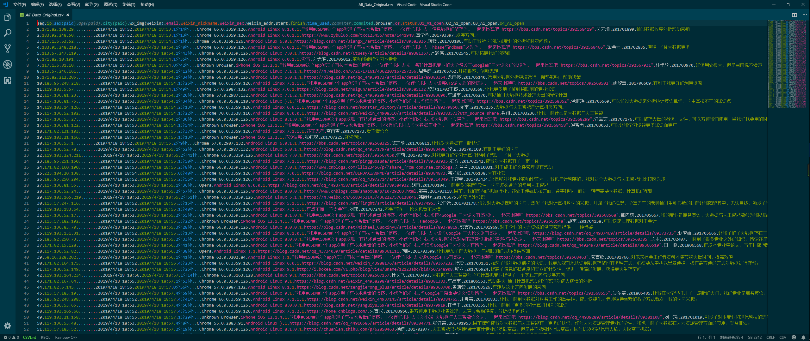
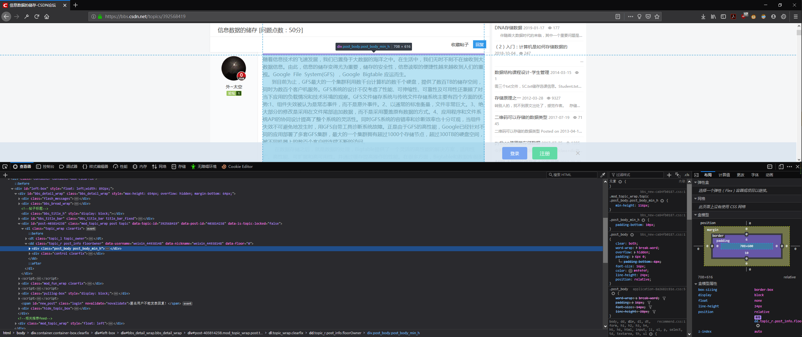
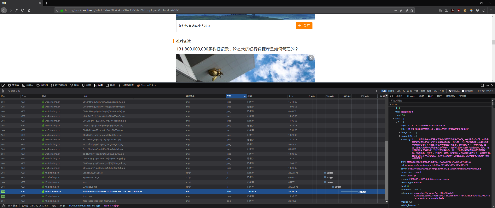
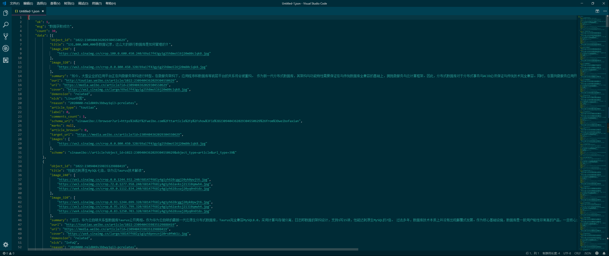

# 项目需求

我们需要遍历一个csv文件，获取每个学生提交的链接和学生的序号  
然后使用Python爬取提交的链接内的文章内容，保存在txt文件中，未提交链接的学生和提交了错误链接的学生单独统计出来  

## 分析

  
使用row指代列，col指代行  
预览CSV文件可知链接在row#19, 学生姓名在row#20  
序号seq在row#1, Value == Row.number - 1

## 实现

使用Python标准库csv解析csv文件  
打开csv文件，创建一个迭代器reader, 遍历reader

```Python
import csv
csvfile = 'All_Data_Original.csv'
with open(csvfile) as f:
    reader = csv.reader(f)
    head_row = next(reader)
    for row in reader:
        print(row[18])
        print(row[19])
        print(reader.line_num - 1)
```

使用next(reader)跳过第一行的参数名  
其中row对应着csv文件的每一行，类型为list，```row[18]```是链接，```row[19]```是姓名，```reader.line_num```是当前行号，减去1后值就等于序号

根据输出结果来看，链接中经常包含一些推广信息，需对链接进行处理，由观察可知所有链接均以http(s)开头，我们使用str的find方法定位http的位置，然后从该位置截取到结尾部分均为链接内容

```Python
position = sourcelink.find('http', 0, len(sourcelink))
link = sourcelink[position:-1] + sourcelink[-1]
```

获取链接后判断一共提交了多少中不同的链接类型，针对不同的类型写爬虫  
获取链接的顶级域名，使用标准库urlparse中```urlparse(url).netloc```方法  
某些网站提供了多种文章发布页面，如csdn的 blog.csdn.net 和 bbs.csdn.net ，遇到这些特殊情况时还需要返回二级域名

```Python
from urllib.parse import urlparse
def gettophost(url):
    host = urlparse(url).netloc
    p = host.find('.', 0, len(host))
    th = host[p+1:-1] + host[-1]
    if th in ['weibo.cn', 'csdn.net', 'cnblogs.com']:
        return host
    else:
        return th
```

把不同网站的爬虫封装成一个个单独的函数  
获取了不同的主机后使用```if...elif...else```语句判断主机类型然后调用对应的函数解析网站获取文章

大多数网站都非常易于爬取，而且爬取的方法基本上一致，以稍微复杂一点点的 bbs.csdn.net 为例  
首先打开浏览器，访问网站，打开开发者控制台进行分析，我这边以Firefox Developer Edition为例（强烈推荐这个浏览器，迅速&优雅)  
使用页面元素选取功能迅速定位了文章部分，在一个div标签内  

这个div的class属性有两个为```post_body```和```post_body_min_h```  
开始写爬虫，我喜欢使用第三方库requests和BeautifulSoup  
首先导入这两个库

```Python
import requests
from bs4 import BeautifulSoup
```

然后构造请求网页的request_header，直接复制当前浏览器的请求头，创建一个叫header的dict，填入对应的Key和Value

```Python
header = {
    'User-Agent': 'Mozilla/5.0 (Windows NT 10.0; Win64; x64; rv:67.0) Gecko/20100101 Firefox/67.0'
}
```

使用requests的session方法自动帮你管理cookie，这样就不用在每次向服务器发送Post/Get请求的时候手动构造包含cookie的dict了  
然后使用BeautifulSoup解析html文档，解析器使用第三方的lxml，速度最快，html文档需要以utf-8编码，避免解析文档内容时出现乱码  
使用for循环遍历目标div，在BeautifulSoup的find_all方法内使用attrs参数以class的值寻找目标div，然后使用div.get_text()方法就可以获取div内所有内容  
最后把文章以文本流形式写入txt文件，文件名为序号.txt

```Python
def bbs_csdn(url, number):
    session = requests.session()
    r = session.get(url, headers=header)
    soup = BeautifulSoup(r.content.decode('utf-8'), 'lxml')
    textfilename = number + '.txt'
    for div in soup.find_all(name='div', attrs={'class': 'post_body_min_h'}, limit=1):
        for js in div.find_all('script'):
            bbs_csdn_article = div.get_text()
            bbs_csdn_article = bbs_csdn_article.replace(js.get_text(), '').strip()
    with open(os.path.join('txt/', textfilename), 'w', encoding=('utf-8')) as f:
        f.write(bbs_csdn_article)
```

之前也有尝试过在for循环内再次嵌套一个for循环遍历div内的p标签然后获取p标签内的内容，然后保存文件的时候每行依次写入来得到一个排版好的文本文档  
但是在具体实现过程中发现，部分用户提交的文档本身排版混乱，滥用元素  
比如下面的

```html
这里是一段示例文字</br>
这里是另一段示例文字</br>
<code>这里是一段不是代码却非要放在code标签内的用户文本</code>
```

遇到以上类似情况的时候，遍历p标签就是会陷入大量的匹配不到文本的情况，所以退而求其次获取整个div内的文本  
但是这样也会有明显的副作用，有些网站会在文档部分的div标签内嵌入```<scripts>```，而脚本内容也会被提取出来，所以再次使用for循环遍历div内的```<scripts>```，然后获取脚本内容，查找替换div文本内的脚本内容为空，最后截去首尾空行，就可以获取较为纯净的文章内容了

难度稍微进阶一点的网站,这里以 media.weibo.cn 为例，不会直接将文档内容放在html中，当使用```requests.session().get()```获取到源码，然后使用```BeautifulSoup.pretiffy()```格式化源码后无法在html源码中发现文章  
打开浏览器，我这里还是以Firefox Developer Edition为例，打开开发者控制台，网络，刷新网页，查看网站json，依次查看json响应，找到需要的数据  
  
Bingo!  
然后查看消息头，请求的json链接为：```https://media.weibo.cn/article/recommendArticle?id=2309404362162398226921&page=1```  
而源文章链接为：```https://media.weibo.cn/article?id=2309404362162398226921```  
这也就意味着只需要获取id后经过简单链接构造就能获取到json  
使用```eval()```函数解析json(或者导入json库后使用```json.loads()```方法，均可)，使用```eval()```前先令```null = ''```  

```Python
def media_weibo_json(url, number)
    null = ''
    url = 'https://media.weibo.cn/article/recommendArticle?id=2309404362162398226921&page=1'
    session  = requests.session()
    r = session.get(url, headers=header)
    dic = eval(r.content)
```

解析后发现这个json格式是一个dict内嵌套着一个大list，然后这个大list内有多个dict，这个dict内又可能有多个小list  


结构类似于这样，我们需要的内容在dic(x)的['summary']key里面  

```json
dic{
    'data':'list[dic1{},dic2{},dic3{}]'
}
```

上代码

```Python
list = dic['data']
for ll in list:
    print(ll['summary'])
```

获取输出后写入到文本文件内即可  
每一个爬虫任务执行完成后睡眠几秒，避免向服务器请求数据太快被返回404等错误或者ban ip，使用time模组的sleep方法

```Python
import time
time.sleep(2)
```

针对每一个不同的网站按以上思路分析，先单独创建一个py文件，然后写出该网站爬虫，最后把代码以函数形式封装整合到主py文件里面来  

文件树如下：  

* All_Data_Original.csv
* spider.py
* blog.csdn.py
* bbs.csdn.py
* ...
* ...
* readme.md

调试的时候针对每个不同的文件(网站)进行调试，确认无误后整合进spider.py  
最后只需要在shell里面```python spider.py```就能运行产生结果

## 一些没有写进去的feature

爬虫说到底就是爬与反爬的斗争，把自己的请求伪装得越像浏览器被反爬的概率越小  
最开始认为是超过1K的爬取相同域名的项目，考虑到了一些反爬和效率上的问题，比如：  

1. 在构造header的时候使用了第三方库fake_useragent创建随机的header

    ```Python
    from fake_useragent import UserAgent
    headers = {
        'User-Agent': UserAgent().random,
    }
    ```

2. 给爬虫使用socks5代理，避免抓取量过大被封ip  
    这个需要本地开启了科学上网工具Shadowsocks  

    ```Python
    proxyon = True
    def enableproxy(bool):
    proxie = {
        'http': 'socks5://127.0.0.1:1080',
        'https': 'socks5://127.0.0.1:1080'
    }
    if bool:
        return proxie
    else:
        proxie = {}
        return proxie
    session = requests.session()
    r = session.get(url, headers=header, proxies = enableproxy(proxyon))
    ````

3. 对csdn的模拟登陆，避免出现某些文章仅登陆后可见  
    方法1：在浏览器中登陆csdn，在开发者控制台的控制台使用document.cookie就可以获取csdn的cookie，携带后再向服务器发送get请求即可  
    方法2：使用requests库的post方法向服务器提交登陆表单
    csdn的登陆页面为：passport.csdn.net/login  
    在开发者工具台的网络中抓取post请求，查看消息头获取了PC端的登陆api：passport.csdn.net/v1/register/pc/login/doLogin  
    登陆参数需要{fkid, loginType, pwdOrVerifyCode, uaToken, userIdentification, webUmidToken}
    其中fkid是一个常量，loginType恒为1，pwdOrVerifyCode是账号密码，uaToken是js随机生成的，html中可以找到，userIdentification是用户名，webUmidToken也是js随机生成的，html中可以找到  
    然后构造login_data，发送post1请求，检查登陆状态  

    ```Python
    login_data = {
        'fkid': '',
        'loginType': '',
        'pwdOrVerifyCode': '',
        'uaToken': '',
        'userIdentification': '',
        'webUmidToken': '',
    }
    r = session.post(api, headers=header, data=login_data)
    if r.starus_code == 200:
        print('login successfully!')
    ````
