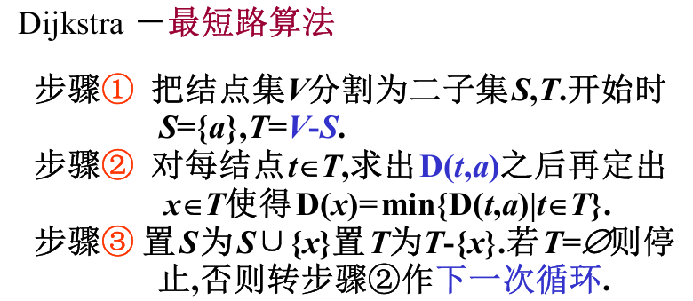
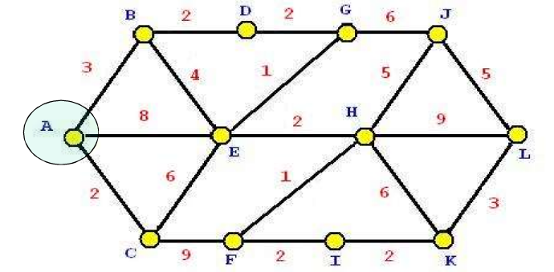
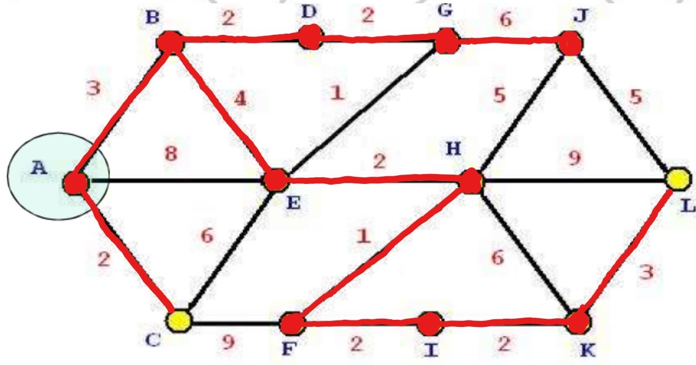
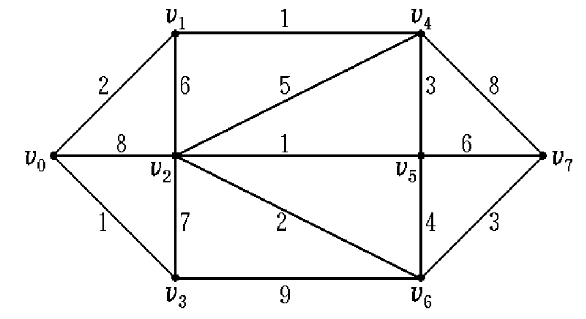
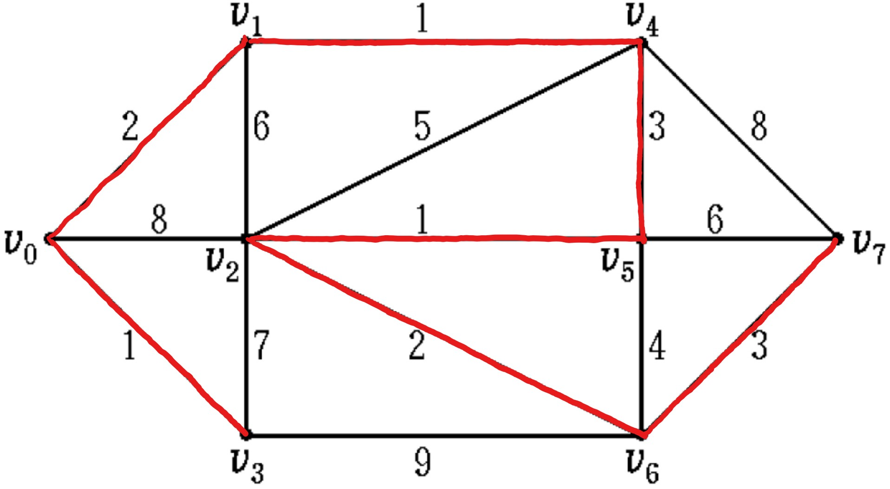
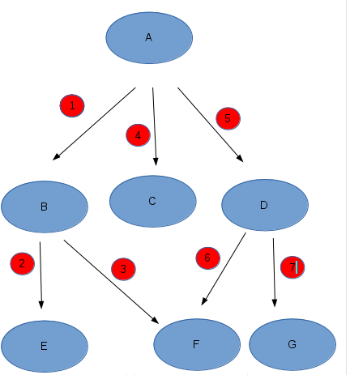

# 第十一周汇报文档

## 图论(最小生成树问题)

1. 最短路径问题

    1. 抽象问题：对一幅图G，我们对每一条边赋权w(e)，成为一个赋权图。H是G的一个子图，则W(H) = sigma(w(e)),也就是对每条边的权求和。寻找从一个点a到另一个b的一个子图，使得权和最小，即为最短路问题。  
    2. 算法实现：Dijkstra算法(迪杰斯特拉算法算法)
      
    通过不断求一个点集合中的每个点和与他相邻点最短路的最小值，这里以下图求A到L最短路为例。
      
    令a1 = A(便于标记),t(a1) = 0(表示点a1到a的最短路)，S={a1}(被选择的点的集合)，T = 0(空集 表示被选择的最短路的边集)。  
    求与S中的点a1与他相邻的点的距离d，取点a2 = C使得距离最小。令S={a1,a2}，T={AC}。  
    重复第二步，求S中的点a1,a2的相邻点中(去除已选择点)，距离最小的那个，则为AB，CE。再取AB，CE中权和最小的一个，B，所以a3=B,令S={a1,a2,a3}，T={AC,AB}。  
    持续下去，不断寻找，S集合中的每个点与他相邻点的最小距离，然后再这些最小距离中找到最小的那个加入到S中，同时加入相应的边。  
      
    T = {AC,ABDGJ,ABEHFIKL}  
    其中A -> B -> E -> H -> F -> I -> K -> L为最短路径

    3. 时间复杂度分析

        Pseudo Code/C++ Style  

        ```Pseudo Code/C++ Style
        1 function Dijkstra(G, w, s)
        2 for each vertex v in V[G]
        3 d[v] := infinity
        4 previous[v] := undefined
        5 d[s] := 0
        6 S := empty set
        7 Q := set of all vertices
        8 while Q is not an empty set
        9 u := Extract_Min(Q)
        10 S := S union {u}
        11 for each edge (u,v) outgoing from u
        12 if d[v] > d[u] + w(u,v)
        13 d[v] := d[u] + w(u,v)
        14 previous[v] := u
        ```

        Row(2-4)：对n个顶点进行初始化，时间复杂度为O(n)  
        Row(5-6)：时间复杂度为O(1)  
        Row(7)：有n个顶点入队列，时间复杂度O(n)  
        Row(8-10)：从8行可以看出进行了n遍循环，每遍在第九行调用一次Extract_Min过程，Extract_Min过程需要搜寻邻接表，每一次需要搜寻整个数组，所以一次操作时间是O(n)，则时间复杂度为O(n*n) = O(n^2)
        Row(11-14)：11行到14行对节点u的邻接表中的边进行检查，总共有|x|次（总共.每条边最多检查一次)，因此时间复杂度是O(x)  
        取最复杂的，所以总的时间复杂度为O(n^2)

2. 最小生成树问题

    1. 抽象问题：在一个连通赋权图中，寻找一颗生成树使得权和最小。
  
    2. 算法实现：Kruskal(克鲁斯卡尔)算法(避圈法)
    
    不断寻找最小权的边即可。  
    结果如下：
    

    3. 时间复杂度分析  
    Pseudo Code/C++ Style  
    .png)  
    Row(1)：初始化生成树的边集A为空集。时间复杂度：O（1）  
    Row(2-3)：对集合中的每一个顶点，都将它的集合初始化为自身。时间复杂度：O(V)  
    Row(4)：将边按权值进行排序。时间复杂度：O(ElogE)  
    Row(5-8)：对排序好后的边从小到大进行判断，如果这条边所连的2个顶点不在同一个集合中，则将这条边加入到生成树的边集A中，并将此边所连的两个顶点u和v的集合做一个Union操作，如此循环加到生成树中的边集数量为n-1时停止。时间复杂度：O(V+E)α(V)  
    时间复杂度取最高的那个即为O(ElogE)

## 什么是AOE网和AOV网

1. 有向图中若以顶点表示活动，有向边表示活动之间的先后关系，这样的图简称为AOV网。  
即如果a->b,那么a是b的先决条件。  

2. 在带权有向图中若以顶点表示事件，有向边表示活动，边上的权值表示该活动持续的时间，这样的图简称为AOE网。  

## 深度优先搜索与广度优先搜索

1. 深度优先搜索  
    以下面的无向图为例：  
      
    由A开始遍历整个图，按照序号从小到大遍历，遍历结果为：  
    A -> B -> E -> F -> C -> D -> G  
    遍历思路：
        1. 访问顶点a。  
        2. 依次从a的未被访问的邻接点出发，对图进行深度优先遍历；直至图中和a有路径相通的顶点都被访问。  
        3. 若此时图中尚有顶点未被访问，则从一个未被访问的顶点出发，重新进行深度优先遍历，直到图中所有顶点均被访问过为止。  

2. 广度优先搜索  
    以下面的一张有向图为例：  
      
    遍历思路：
        从图中某顶点a出发，在访问了a之后依次访问a的各个未曾访问过的邻接点，然后分别从这些邻接点出发依次访问它们的邻接点，并使得“先被访问的顶点的邻接点先于后被访问的顶点的邻接点被访问，直至图中所有已被访问的顶点的邻接点都被访问到”。如果此时图中尚有顶点未被访问，则需要另选一个未曾被访问过的顶点作为新的起始点，重复上述过程，直至图中所有顶点都被访问到为止。  

## 递归程序和非递归程序

1. 递归程序与非递归程序的优缺点  
递归程序相较非递归程序更易于理解，代码量较少。  
缺点：需要递归地调用方法，而每调用一次方法就需要为这个方法单独开辟一个栈空间，时间复杂度和空间复杂度更高，容易造成Stack Overflow。

2. 时间复杂度分析(以斐波那契数列为例)
    * 使用递归方法

    ```C++
    int recursive_method(int n)
    {
        if (n == 1 || n == 2)
            return 1;
        else
            return recursive_method(n - 1) + recursive_method(n - 2);
    }
    ```

    在递归调用过程中Fib(3)被计算了2次，Fib(2)被计算了3次。Fib(1)被调用了5次，Fib(0)中被调用了3次。所以，递归的效率低下，但优点是代码简单，容易理解。  
    递归算法时间复杂度为：O(2^(N/2))<=T(N)<=O(2^N)。

    * 使用非递归方法

    ```C++
    int non_recursive_method(int n)
    {
        int p = 1;
        int q = 1;
        if (n == 1 || n == 2)
            return 1;
        else
        {
            for(int i = 3; i < n; i++)
            {
                int tmp = p;//将第一个值p赋给tmp
                p = q;       //将第二个值q赋给p,以后每一次赋值都将得到的新的F(n)赋给p,从后面语句可//以看出,q储存的为最新的F(n)
                q = tmp + q;
            }

            return q;
        }
    }
    ```

    使用非递归方法的时间复杂度为O(n)
3. 转换  
OnGoing...
